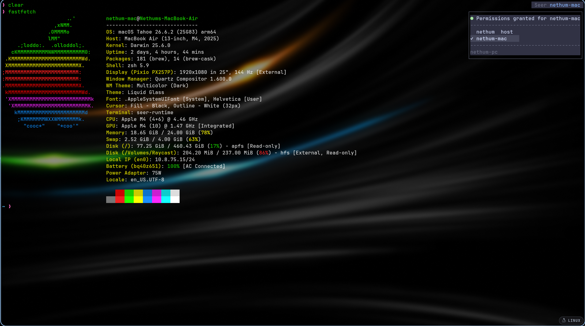
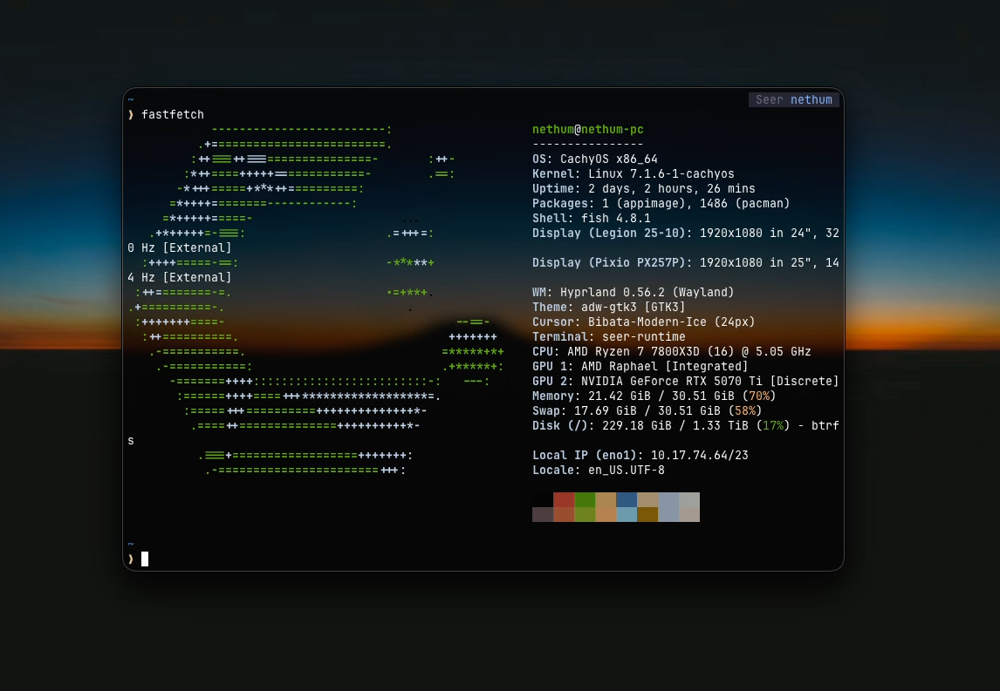
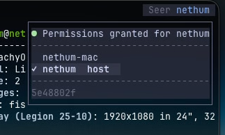

# Seer

Seer shares live terminals in a room. One person hosts the room. Each
person runs their own terminals on their own computer.

- Your terminals use your own files, tools, shell, and logins.
- Everyone in the room can watch the terminals of everyone else.
- One grant, "can type here", lets another person type into your
  terminals.
- Linux and macOS. Version 0.5.7.

## Install

    curl -fsSL https://raw.githubusercontent.com/nethum529/seer-releases/main/install.sh | sh

- The installer puts the binaries in ~/.local/bin. It does not use sudo.
- You do not need Rust, Git, or a GitHub account.
- Restart the terminal if the installer asks you to.

## Host a room

The room server runs on Linux only.

    seer start

The command prints a join line. Send it to a friend. A join line works
one time and expires in 1 hour. The line is the credential for the
room, so send it the way you send a password.

Make a new line, with a life of 1 to 168 hours:

    seer invite --hours 24

## Join a room

Paste the line from the host into your terminal.

- With Seer installed, the line starts with `seer join`.
- Without Seer, use the install line that the host sends with it. It
  installs Seer and joins in one step.

Then select a name. Press Enter to accept your system user name.

## Open Seer

    seer

- Type or paste to send input to the selected terminal.
- All keys go to the terminal. Seer has no prefix key.
- Click a terminal to select it. Drag to select and copy text.

## People and permissions

Left click the control at the top right to open the people picker.

- The first line shows your typing permission for the person you watch.
- The list shows every person, with the host marked.
- Select a person to see their live terminals.
- A terminal takes its name from its foreground program. A shell uses
  the name "shell" and the state "idle". Other programs are "busy".

Right click a person row to open their menu. It shows their presence,
idle time, and terminals. Use j and k to select, Enter to watch, and
Space to give or remove your "can type here" grant. The box changes
when the room server confirms it.

A grant is for one person and for one direction. It permits that
person to type and to use the mouse in your terminals. It permits
nothing more. No person in the room can open, close, select, or
resize your terminals. Remove a grant with Space, or remove every
grant at one time with `seer perms --off`.

Right click the top right control for the session panel. Use it to
open, close, or select a terminal, copy the join line, go back, and
quit Seer.

## Commands

- `seer` opens the people and terminals screen. `seer attach` is the
  same.
- `seer start` opens a new room. The people of the old room are
  removed. `seer start --restore` reopens the old room with its people.
- `seer invite --hours N` makes a new join line.
- `seer join <line>` joins a room.
- `seer perms --on` lets every person in the room type into your
  terminals. `seer perms --off` removes every grant.
- `seer peek <person>` opens Seer with that person selected.
- `seer list` lists your saved rooms and people.
- `seer detach` disconnects a selected client. Its terminals continue.
- `seer leave` removes you from the room and stops your terminals on
  this computer. The room stays open for the others.
- `seer stop` stops the room server. Only the host can do this. Other
  people keep their terminals.
- `seer ps` shows your Seer processes on this computer. `seer ps
  --clean` stops the windows that have no terminal. `seer ps --stop
  <pid>` stops one runtime with its shells.
- `seer update` installs the latest release.
- `seer exit` leaves Seer from inside a Seer terminal.

## Good to know

- Your local shells continue when you close the Seer window or lose
  the room connection. Open Seer again to return to them.
- A restart of the computer or the runtime restores the saved layout
  with new shells. The old programs do not come back.
- One computer at a time can publish the terminals of one person.
- All persons must use the same major and minor version. A different
  version prints a message that tells you to run `seer update`.
- Remote connections are encrypted from end to end. A join line gives
  access to the room and to nothing else on the host computer: not
  ssh, not the other ports, not the other services. See
  [ADR 0002](docs/adr/0002-builtin-connect.md).
- The host is trusted. The host computer moves the data of the room.
- Seer controls use Catppuccin Mocha colors when COLORTERM is
  truecolor, and 16 colors if not. Terminal output keeps the colors of
  your own terminal.
- Your terminal must permit clipboard access to copy the join line.
- There is no chat. An agent inbox is planned but not built.

## Known faults

- `seer stop` fails with a buffer error and the room server continues.
  Stop the server process by hand. See issue 436.

## Build from source

    cargo build --workspace

Read [CONTRIBUTING.md](CONTRIBUTING.md) before a change. The decisions
are in docs/adr/. The research is in docs/research/.
